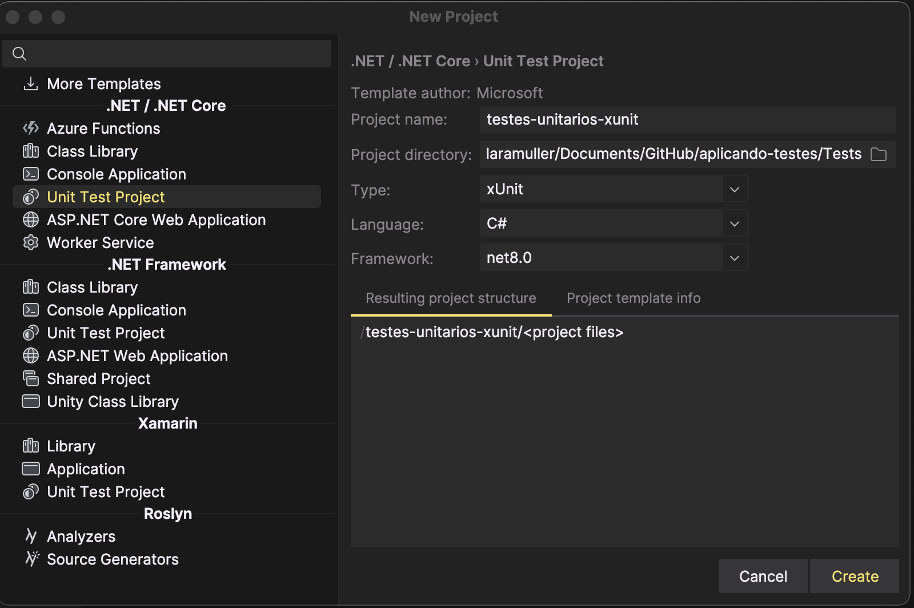
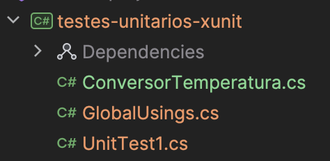
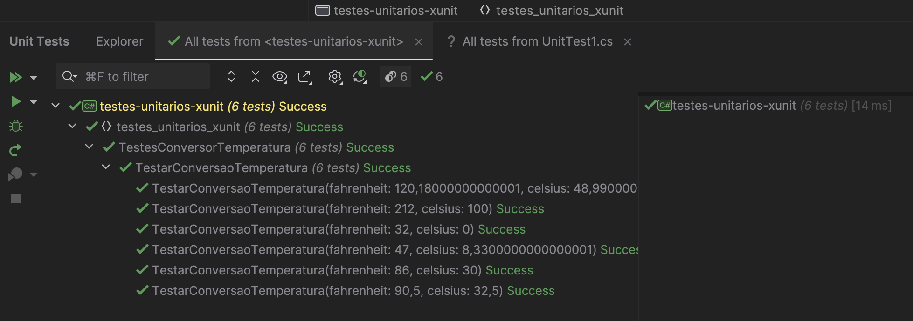
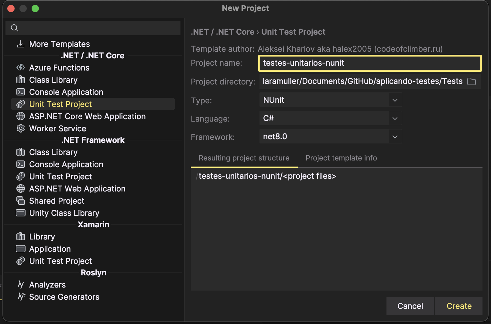
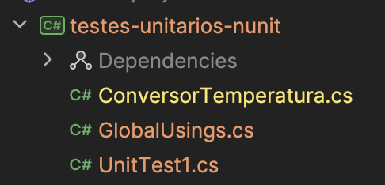
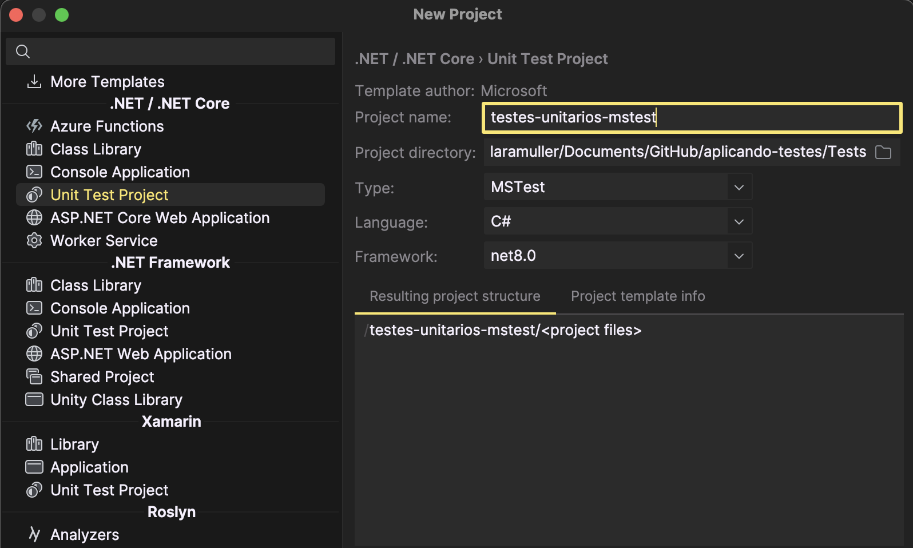
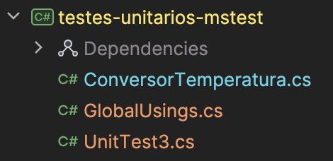
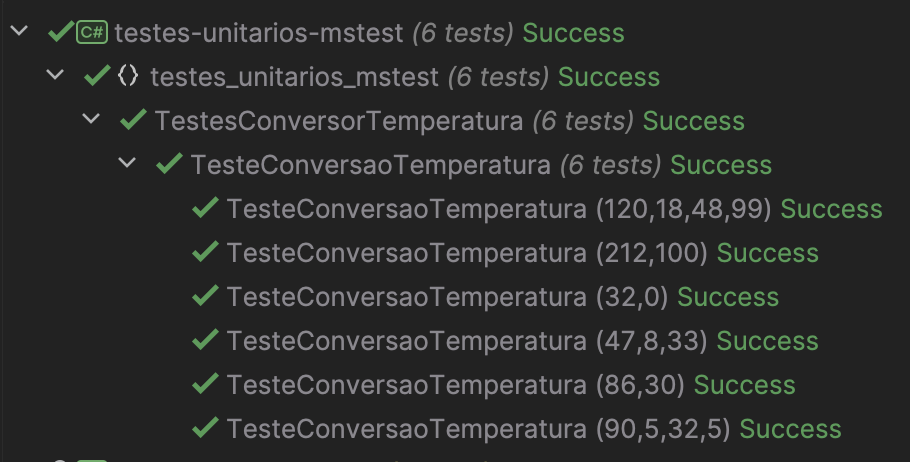

# Testes de Software com .NET 5: exemplos de utilização
Deverá haver um commit para cada teste implementado.

O seu repositório deverá ter no arquivo reaadme uma seção para cada tipo de testes. Nessa seção, você irá detalhar de forma clara objetiva a aplicação do testes e fornecer dois cenários de exemplo.

Na seção de cada teste, após as descrições, coloque um print do teste sendo executado.

Substituir o texto do barema por:

(De 0 a 3) - Implementação dos 3 tipos de testes apresentados no artigo (1 ponto para cada tipo de teste implementado)
(De 0 a 2) - Explicação clara e objetiva sobre a aplicação dos testes
(De 0 a 2) - Organização do arquivo readme, com imagens dos testes e coerência dos textos.
## Tecnologias e conceitos aprendidos
- .NET
- JetBrains Rider (IDE)
- xUnit
- NUnit
- MS Test
- Testes unitários
## Testes de unidade
- Iremos implementar testes de unidade para um método que transforma graus Fahrenheit para a escala de Celsius.
## 1. Xunit - testes unitários
1. Criação de uma solução vazia, e, após, criação de um projeto de unit tests com Xunit:

2. Criação do método de conversão de escalas te temperatura
3. Configuração de 6 testes unitários para testar o método criado anteriormente.
3. Testes rodados. Resultado: todos os testes passaram com sucesso.

## 2. NUnit - testes unitários
1. Criação de um novo projeto, dentro da solution criada anteriormente.

2. Replicação do método de conversão de temperatura para dentro desse project:

3. Configuração de 6 testes de unidade para testar o método de conversão.
4. Testes rodados, através da IDE Rider. Resultado: todos os 6 testes passaram com sucesso.

## 3. MS Test - testes unitários
1. Criação de um terceito projeto, dentro da solution criada anteriormente.

2. Replicação do método de conversão de temperatura para dentro desse projeto:

3. Configuração de 6 testes de unidade para testar o método de conversão.
4. Testes rodados, através da IDE. Resultado: todos os 6 testes passaram com sucesso.
