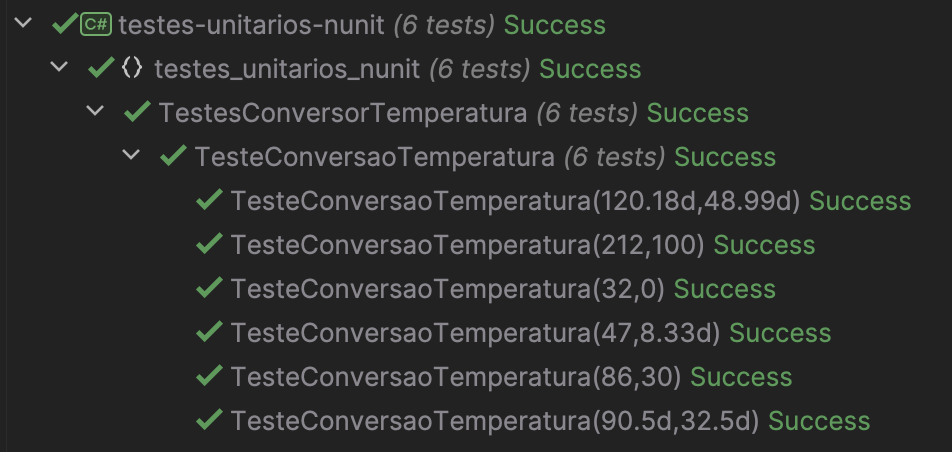
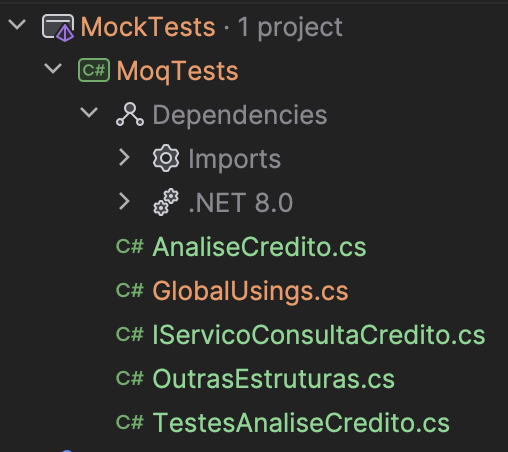

# Testes de Software com .NET 5: exemplos de utilização
## Tecnologias e conceitos aprendidos
- .NET
- JetBrains Rider (IDE)
- xUnit
- NUnit
- MS Test
- Testes unitários
## 1. Testes de unidade
- Iremos implementar testes de unidade para um método que transforma graus Fahrenheit para a escala de Celsius.
- Foram utilizadas 3 ferramentas diferentes, mas com o mesmo intuito, com o objetivo de conhecer diferentes ferramentas, e comparar as diferentes performances, para os mesmos cenários propostos.
- Para os testes com as 3 ferramentas, aplica-se:
  - **Objetivo:** Verificar se o método ConversorTemperatura.FahrenheitParaCelsius retorna a temperatura correta em Celsius para um dado valor em Fahrenheit.
  - **Funcionalidade Testada:** Método ConversorTemperatura.FahrenheitParaCelsius
  - **Resultados Esperados**
    
    Para 32°F: 0°C
    
    Para 47°F: 8.33°C
    
    Para 86°F: 30°C
    
    Para 90.5°F: 32.5°C
    
    Para 120.18°F: 48.99°C
    
    Para 212°F: 100°C
    
  - **Resultados Obtidos**
    
    **Saída Real:** 0, 8.33, 30, 32.5, 48.99, 100
    
    **Comparação**: Resultados esperados e reais coincidem.
  - **Status dos Testes:** Aprovados
    
### 1.1 Xunit - testes unitários
1. Criação de uma solução vazia, e, após, criação de um projeto de unit tests com Xunit:

2. Criação do método de conversão de escalas te temperatura:

3. Configuração de 6 testes unitários para testar o método criado anteriormente.
4. Testes rodados. Resultado: todos os testes passaram com sucesso:

### 1.2 NUnit - testes unitários
1. Criação de um novo projeto, dentro da solution criada anteriormente:

2. Replicação do método de conversão de temperatura para dentro desse project:

3. Configuração de 6 testes de unidade para testar o método de conversão.
4. Testes rodados, através da IDE Rider. Resultado: todos os 6 testes passaram com sucesso:

## 1.3 MS Test - testes unitários
1. Criação de um terceito projeto, dentro da solution criada anteriormente:

2. Replicação do método de conversão de temperatura para dentro desse projeto:

3. Configuração de 6 testes de unidade para testar o método de conversão.
4. Testes rodados, através da IDE. Resultado: todos os 6 testes passaram com sucesso:

## 2. Mock Objects
- Mocks representam uma abordagem que permite simular o comportamento de objetos em diferentes cenários.
- Nos exemplos a seguir, iremos testar um métodos que faz uma Consulta de Crédito de um cliente em sua conta bancária.
### 2.1 Exemplo de implementação com xUnit + Moq + Fluent Assertions
1. Criar solução vazia, e adicionar um novo projeto de testes unitarios:

2. Definir método a ser testado, e cenários de teste;
3. Rodar testes:

4. Resultado: todos os testes passaram com sucesso.

### 2.2 Exemplo de implementação com xUnit + NSubstitute + Fluent Assertions
1. Adicionar um novo projeto de testes unitarios à solução criada:

2. Definir método a ser testado, e cenários de teste;
3. Rodar testes:

4. Resultado: todos os testes passaram com sucesso.
